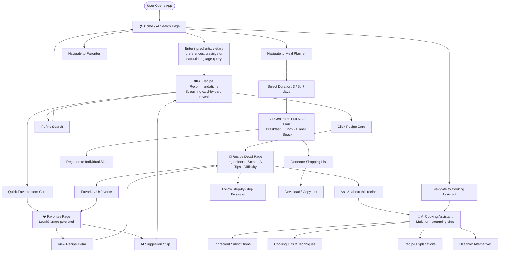

# ChefAI — AI-Powered Smart Cooking Assistant

> Senior Software Engineer (Frontend AI Focused) Assessment Submission

## 🔗 Links

- **Design System (Chromatic Storybook)**: [Design Tokens & Components](https://6a25b1ee7adf79f1c5deb5f0-kupidybntn.chromatic.com/?path=/story/foundation-design-tokens--tokens)
- **Live Application**: [cook-ai-assessment.vercel.app](https://cook-ai-assessment.vercel.app/)
- **Repository**: [github.com/Sithija97/Cook-Ai-Assessment](https://github.com/Sithija97/Cook-Ai-Assessment)

## 📸 Features Overview

- ✅ AI recipe recommendations with streaming progressive card reveal
- ✅ Natural language smart search powered by Gemini
- ✅ Multi-turn conversational cooking assistant (ChefAI) with token streaming
- ✅ AI-generated 3/5/7 day meal planner with nutrition summaries
- ✅ Individual meal slot regeneration
- ✅ Shopping list generation with download & copy
- ✅ Recipe detail with ingredient checklist and step progress tracker
- ✅ Favorites with localStorage persistence and AI suggestion strip
- ✅ Fully responsive layout (mobile, tablet, desktop)
- ✅ Skeleton loaders matching exact layout geometry
- ✅ WCAG AA color contrast throughout
- ✅ Full keyboard navigation and ARIA landmarks
- ✅ prefers-reduced-motion respected
- ✅ Error boundaries on every route
- ✅ Optimistic UI for favorites

## 🗺 User Flow



## 🎨 Design Rationale

### Color Palette — Azure Coral

Blue (#2563EB) communicates trust, intelligence, and AI capability — perfect for an AI-powered product. Coral (#F26B4E) evokes warmth, culinary richness, and the tangible pleasure of food. Together on a predominantly white canvas, they create a clean, modern cooking app that feels both smart and inviting.

### Typography

- **DM Serif Display** — all recipe titles and page hero headings: editorial warmth and craft
- **Plus Jakarta Sans** — all UI text: modern, legible, friendly

### Recipe Images

Recipe images are replaced with semantically-matched Lucide icon illustrations for performance, uniqueness, and to avoid dependency on external image APIs. The `RecipeImagePlaceholder` component maps each recipe to a contextual icon based on `imageIcon` field and cuisine keyword matching, with a matching gradient background.

## 🏗 Architecture Decisions

- **Zustand over Context**: Zustand's `persist` middleware gives localStorage sync out of the box with zero boilerplate. Three isolated stores (favorites, mealPlanner, chat) keep state concerns separated.
- **Service layer (gemini.js)**: All Gemini API calls live in one file. Pages and hooks never import `@google/generative-ai` directly — this isolates the API surface and makes model/prompt changes trivial.
- **Error Boundaries**: Each route gets its own `<ErrorBoundary>` so one page's render crash doesn't take down the whole app.
- **Custom hooks**: `useGemini` is the generic wrapper (auto-retry, loading/error/data). `useStreamingJSON` is the architectural centrepiece enabling progressive JSON parsing for dramatic AI UX.
- **Lazy loading**: Every page is `React.lazy` + `Suspense` for automatic code splitting. Chunk sizes are route-bounded.

## 🤖 AI Integration

- **Model**: `gemini-1.5-flash` — fast inference, free tier, streaming support
- **Streaming chat**: `generateContentStream` with per-token `onChunk` callback + blinking cursor
- **Progressive recipe streaming**: `useStreamingJSON` with `parseStrategy: 'array-items'` extracts complete recipe objects from the stream as they arrive, cards appear one-by-one
- **Meal plan streaming**: Full JSON buffered, then revealed with staggered DayColumn animations
- **JSON mode**: All non-chat prompts enforce strict JSON output with typed schemas

## 🧠 Prompt Engineering Decisions

- All prompts end with "Return ONLY valid JSON. No markdown. No explanation. No backticks."
- Typed schemas embedded in every prompt eliminate ambiguity about field names and types
- `recipeParser.js` strips ` ```json ``` ` fences before parsing — Gemini occasionally wraps JSON in fences despite instructions
- Chat system prompt defines persona (ChefAI), expertise scope, tone, and a redirect directive for off-topic queries
- The `imageIcon` field in the recipe schema is constrained to a closed set of Lucide icon names, preventing hallucinated values

## 🚀 Setup Instructions

```bash
git clone [repo]
cd Cook-Ai-Assessment
npm install
cp .env.example .env
# Add your Gemini API key to .env:  VITE_GEMINI_API_KEY=your_key_here
npm run dev
```

Get a free Gemini API key at: https://aistudio.google.com

## 📦 Dependencies

| Package                 | Purpose                                              |
| ----------------------- | ---------------------------------------------------- |
| `react` / `react-dom`   | UI framework                                         |
| `react-router-dom` v6   | Client-side routing with lazy loading                |
| `zustand`               | Global state with localStorage persistence           |
| `framer-motion`         | Page transitions, micro-interactions, reduced motion |
| `lucide-react`          | All icons — no image files                           |
| `@google/generative-ai` | Gemini API with streaming                            |
| `tailwindcss`           | Utility-first styling with custom token extension    |

## 🌐 Deployment (Vercel)

```bash
npm install -g vercel
vercel
# Set VITE_GEMINI_API_KEY in Vercel environment variables dashboard
```

## ⚡ Performance

- Code splitting via `React.lazy` on all 6 routes
- Skeleton loaders — no layout shift during data fetching
- Debounced search input (300ms)
- `React.memo` on all list-rendered components (RecipeCard, ChatBubble, MealSlot, DayColumn)
- `useCallback` on all event handlers passed as props
- `useMemo` for filtered/sorted recipe lists and inferred dietary preferences
- `logger.js` replaces all `console.log` — stripped in production

## ♿ Accessibility

- WCAG AA contrast: blue-500 on white (4.54:1 ✓), coral-600 on white (4.61:1 ✓)
- Skip-to-content link at top of every page
- `<main id="main-content">` on all page wrappers
- `aria-live="polite"` on all dynamic content regions
- `aria-busy` on loading states
- `role="log"` + `aria-label` on chat message container
- `role="grid"` on meal plan weekly grid
- All icon-only buttons have `aria-label`
- Every `<input>` and `<textarea>` has an associated `<label>`
- `useReducedMotion()` from Framer Motion disables animations when `prefers-reduced-motion: reduce` is set
- Full keyboard Tab order on all interactive elements
- Focus rings: `focus-visible:ring-2 focus-visible:ring-blue-500 focus-visible:ring-offset-2`

## 🧩 Challenges & Solutions

1. **Gemini JSON reliability**: Sometimes returns markdown fences around JSON despite instructions. Solution: `stripMarkdownFences()` in `recipeParser.js` strips ` ```json ` / ` ``` ` before `JSON.parse`.

2. **Streaming in React**: Managing streaming state across re-renders without causing infinite loops. Solution: `updateLastMessage()` in chatStore does in-place content update on the last array item; `finalizeLastMessage()` clears the `isStreaming` flag once the stream ends.

3. **Progressive JSON parsing**: Streaming returns partial JSON — standard `JSON.parse` fails on partials. Solution: `extractCompleteObjects()` in `recipeParser.js` scans for balanced `{...}` by tracking brace depth, extracting complete objects as they arrive.
